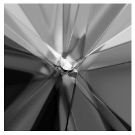
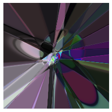

# Super-Resolution-Images

From lower resolution image to higher resolution.

For this I will be trying multiple methods. All of them are as follows:

## Using GAN

I used `mnist` dataset. First I downsampled the data to 26x26 that will act as my input (Low resolution LR images) to the model
and kept the actual 28x28 images as my ground truth (from here High Resolution HR images). The model will generate images of dimension
28x28 (Super Resolution SR images). The structure of model is not like a usual GAN.

The genrator part of the GAN is basically an Variational Autoencoder's encoder part in starting that generates a latent vector which is given as an input to the latter part that is like a usual generator. The use of reparametrization trick helps to flow the gradient back to VAE part.

The discriminator is acting on HR and SR. The loss function I used for the Generator part is a combination of reconstruction loss of HR and SR
sum with the loss of images detected as fake by discriminator.

")

*LR Images (26x26)*

")

*HR Images (28x28)*

Results came out to be satisfactory considering the simplicity of the model.

## CPPN

CPPN stands for Compositional Pattern Producing Network.

**How it works?**

Suppose if we can represent an image pixel intensity as an output of the function `f(w, x, y, r)`, the output is a single number in case of black and white image or a vector of three numbers between 0 to 1 representing the intensity of the pixel. It learns the relation between (x, y) and r (radius) of 
a line at that point. These models are very specific, they can only draw what they are trained on. Using CPPN helps to generate suprisingly high resolution images.

The idea was taken form [here](https://github.com/hardmaru/cppn-tensorflow).

In the file I just took a random vector and generated images. We can combine this with GAN and produce Super Resolution meaningful images. Here are some results, images are of 1800x1800 resolution.

## Future Work

Combine above GAN and CPPN to produce super resolution MNSIT images. In that case we will train the CPPN for 28x28 output and then will use the weights to
generate higher resolution images.
